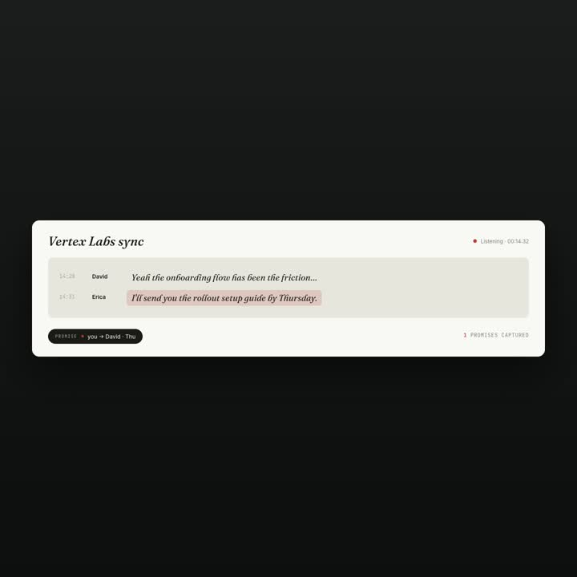

# explainer-video

A [Claude Code](https://claude.ai/code) skill that turns product information — Lark/Feishu docs, GitHub repos, screenshots, PDFs, or a plain description — into a **launch-quality product explainer video**, on your own machine, in one prompt.

Square for X/LinkedIn, vertical for TikTok/Reels, landscape for YouTube — pick any aspect ratio. Pure-B-roll mode (no on-camera talking head needed) handles 80% of product demos at $0 per render. Five built-in copyright-safe design presets cover the OpenAI / Anthropic / Linear / Apple / brand-bold aesthetic spectrum, or paste your own `design.md`.

---

## 30-second demo

A 49-second 1:1 launch video for **Syncore**, a Mac desktop app for capturing post-meeting commitments — generated end-to-end by this skill in pure-broll mode using the `anthropic-warm` preset.

https://github.com/encircleacity2/bobyte-explainer/blob/main/assets/demos/syncore.mp4



Story: Erica makes a promise to David in a meeting → Syncore captures it → hours later Claude drafts the email with full context → the promise gets kept. 8 frames, 4 cursor-driven clicks, one central quote echoing across 3 frames. Render time: ~3 minutes locally. Total cost: $0.20 (music only).

---

## Who this is for

**Knowledge workers** who need a polished product video this week — founders launching a tool, PMs explaining a workflow, devrel folks shipping a release, indie hackers announcing a feature.

You probably:
- Don't have a video producer on retainer
- Don't want a $200/seat SaaS that locks you into one aesthetic
- Don't want to record yourself on camera every time
- Care that the video matches your brand, not someone else's template
- Want to ship the video in the same afternoon you decide to make it

If that's you, this skill is faster than hiring out and produces better-looking video than any drag-and-drop tool you've tried.

---

## Highlight features

### 🎬 Pure-B-roll mode — no presenter required
The default for product launches. No talking head, no Seedance API calls, no portrait photo to onboard. The video is polished motion + UI + typography + music. Saves ~80% of the cost vs hybrid mode and produces the OpenAI/Apple-style aesthetic most modern product videos use.

### 📐 Choose your distribution channel upfront
Phase 1 preflight asks where the video will live and picks the right aspect ratio + duration sweet spot automatically:

| Channel | Aspect | Duration sweet spot |
|---|---|---|
| X / LinkedIn / IG feed | 1:1 | 30-60s |
| TikTok / Reels / Shorts | 9:16 | 21-34s |
| YouTube / website hero | 16:9 | 60-180s |

### 🎨 5 built-in design presets (or bring your own)
- **`openai-clean`** — geometric bold sans + lavender liquid + minimal
- **`anthropic-warm`** — warm earth tones + serif italic + literary
- **`linear-minimal`** — dark mode + neon accents + technical
- **`apple-keynote`** — deep black + hero typography + cinematic
- **`brand-bold`** — high contrast + oversized type + color-block

Each preset is documented as a real `design.md` and tunes palette, typography, motion easings, and "default scene recipe" to that aesthetic. Or paste your own `design.md` and the skill renders against your brand.

### 📖 Storyline as a first-class concept
The skill enforces a 5-beat narrative arc (hook → tension → reveal → magic → promise) plus 8 production patterns distilled from real launch storylines:

- **Canon** — 3-5 specific named entities preserved across every frame ("David Chen", not "a colleague")
- **Echo** — one artifact recurs in 2+ frames as visual rhyme
- **Cast** — named protagonist with a role and motivation (no "the user")
- **Frame-name keywords** — SUMMON · DETECT · KEPT (one word per scene)
- **Per-frame narration** — exact line OR explicit `silent: true`
- **Breather beat** — one almost-empty pause that lets the magic land
- **Click chain** — cursor clicks drive scene transitions (when there's UI)
- **Storyline as handoff doc** — storyboard.md doubles as the production spec

A built-in auditor blocks render if the storyboard is just "a sequence of UI screens with no story" — the #1 reason finished videos don't communicate.

### ✋ 3-option approval gate, in your language
Phase 3 ends with an explicit AskUserQuestion in **your conversation language**: Approve / Suggest changes / Stop. No render runs on "looks good 👍". If you suggest changes, the model revises and re-presents — looping until you click approve or stop.

### 🔍 7 validators with auto-fix loop
Before render and after, a unified `verify.py` runs 7 validators (storyboard audit / overlap / asset existence / camera overflow / render-spec match / audio levels / contrast). Auto-fix can mechanically repair the safe subset (cap camera scales, re-encode video keyframes, re-mix audio gain, deconflict tracks) and re-verify, up to N iterations.

### 🎞️ 60fps render by default
Every video renders at 60fps `--quality high` — visibly smoother than the 30fps default most tools settle for. Motion follows a "house style" reference doc that bans linear easings and codifies entrance/exit/camera curves so the motion craft is consistent across compositions.

### 🎵 Optional AI background music
If enabled at onboarding, the skill generates a custom instrumental via Volcengine's music API per video (matching the storyboard's mood prompt), then sidechain-ducks against any voice. Cost: ~$0.20 per track. Disable entirely if you prefer to add music yourself.

### 🤖 A-roll digital human (optional, hybrid mode)
For personal-brand videos where you want to appear on camera: hybrid mode generates a Seedance 2.0 AI talking-head from your portrait photo + reference voice clip, then composes it with B-roll. Skip this mode for product launches — it's not needed and adds cost.

---

## The 5-phase workflow

```
First-run onboarding (once)
        │
        ▼
┌──────────┐   ┌──────────┐   ┌──────────┐   ┌──────────┐   ┌──────────┐
│ Phase 1  │ → │ Phase 2  │ → │ Phase 3  │ → │ Phase 4  │ → │ Phase 5  │
│ Intake + │   │ Restyle  │   │Storyboard│   │Production│   │ Deliver  │
│Preflight │   │(skipped) │   │+ Approval│   │ + Verify │   │  MP4     │
└──────────┘   └──────────┘   └──────────┘   └──────────┘   └──────────┘
   parse        Seedream 4.5    3-option       60fps         save to
   inputs       portrait        gate           HyperFrames   output
   + ask 3 Qs   (only hybrid)   in user lang   + music       folder
```

### Phase 1 — Intake + Preflight

Reads your input (URL / file / description) into a `product-brief.md`, then asks 3 questions in your conversation language:

1. **Mode** — pure-broll-product-demo (default) / aroll-broll-hybrid / aroll-only
2. **Visual identity** — your design.md, or one of 5 built-in presets
3. **Distribution channel** — X 1:1 / TikTok 9:16 / YouTube 16:9 / multi-channel

### Phase 2 — Portrait restyle (skipped in pure-broll mode)

For hybrid mode only: Seedream 4.5 restyles your portrait (new outfit, environment, lighting) and you pick a variant. Skipped entirely in pure-broll.

### Phase 3 — Storyboard + approval gate

Drafts the storyboard in 9 mandatory steps (Cast → Canon → Echo → Narrative answers → Frame names → Narration cues → Click chain → arc_map → then segments). Runs `verify.py --mode pre --auto-fix` to catch structural issues. Presents storyboard inline in your conversation language. Asks you to **Approve / Suggest changes / Stop**.

### Phase 4 — Production

- Auto-installs any HyperFrames registry blocks the storyboard references
- Generates the composition HTML from storyboard + chosen style preset
- Renders at 60fps `--quality high`
- (Optional) Beat-aligns timing to the music's detected onsets
- (Optional, opt-in only) Two-pass meta-output beat for recursive/video products
- Generates Volcengine music if enabled
- Mixes (sidechain ducking under any voice)
- Runs post-render `verify.py` — audio level adjustments auto-applied

### Phase 5 — Deliver

Saves the MP4 to your configured output folder (default `~/Downloads`). Reports duration, size, path. Optionally uploads to Lark with explicit confirmation.

---

## Installing

```bash
# Clone into the Claude Code skills directory
git clone https://github.com/encircleacity2/bobyte-explainer.git \
  ~/.claude/skills/explainer-video

# Restart your Claude Code session to pick it up
```

Trigger phrases:

> "Make an explainer video about &lt;product&gt;"
> "Produce a Shorts video for this GitHub repo"
> "Turn this skill pack into a launch video"

On first use the skill walks you through a one-time setup that writes `~/.explainer-video/config.json` (mode 600). See **Onboarding** below.

## Onboarding (first run, ~3 min)

Two paths:

- **Credential file** — fill in a copy of [`credentials.template.md`](credentials.template.md) and give the skill its path. Fast path; the template is designed to be emailed to teammates.
- **Step-by-step** — the skill prompts for each item interactively in your conversation language.

Either way it collects:

1. The **BytePlus ModelArk API key** (only needed for hybrid / aroll-only modes)
2. The **BytePlus IAM AK / SK** (only needed for hybrid / aroll-only modes)
3. A **personal photo** + **portrait video with audio** (only for hybrid / aroll-only)
4. The preferred **output folder** (default `~/Downloads`)
5. Whether to enable **automatic AI music**. If yes: **Volcengine music AK / SK**.

Pure-broll users can skip step 1-3 and still produce videos.

## Requirements

- **Node 18+** and npm (HyperFrames renderer)
- **Python 3.11+** (the skill's audit + verify scripts; venv recommended)
- **ffmpeg** (compose, mux, audio level adjustments)
- **Chrome / Chromium** (headless render — managed by HyperFrames automatically)

Optional:
- **BytePlus ModelArk + IAM keys** — only for aroll modes
- **Volcengine music keys** — only if you want AI background music
- **`lark-cli`** — only if you ingest Lark/Feishu docs or upload finals to Lark

Python packages (installed as needed):

```bash
pip install --user requests Pillow volcengine anthropic librosa
```

---

## Documentation map

### Critical (read in this order)

1. **[`SKILL.md`](SKILL.md)** — the orchestration spec: onboarding + 5-phase workflow + approval-gate protocol
2. **[`references/narrative-arc.md`](references/narrative-arc.md)** — story craft + 8 production patterns + the Syncore wrong-vs-right example
3. **[`references/storyboard-format.md`](references/storyboard-format.md)** — full storyboard.json schema (mode, aspect_ratio, narrative, canon, cast, echo, arc_map, click_chain, per-segment fields)
4. **[`references/motion-house-style.md`](references/motion-house-style.md)** — non-negotiable easings, frame rates, duration windows. **Read before authoring any GSAP.**

### Channel + brand

5. **[`references/style-presets.md`](references/style-presets.md)** — 5 built-in presets + when-to-use guide
6. **[`references/channel-aspect-ratios.md`](references/channel-aspect-ratios.md)** — distribution channel × aspect × duration matrix with safe-zone info
7. **[`assets/style-presets/<name>/design.md`](assets/style-presets/)** — each preset's full design tokens

### Recipes + components

8. **[`templates/openai-product-demo.json`](templates/openai-product-demo.json)** — canonical recipe for pure-broll mode (with all 8 narrative patterns as REPLACE: placeholders)
9. **[`templates/agent-chip-row.html`](templates/agent-chip-row.html)** — opening pattern with named agent icons
10. **[`references/hyperframes-catalog.md`](references/hyperframes-catalog.md)** — curated subset of the HyperFrames registry (~15 high-value blocks)
11. **[`references/caption-components.md`](references/caption-components.md)** — caption components per preset (replaces deprecated PIL pattern)
12. **[`references/screen-script-format.md`](references/screen-script-format.md)** — how to script device-mockup screen content (LLM-synth vs raw-screenshots)
13. **[`references/agent-list.md`](references/agent-list.md)** — known AI coding agents (Claude Code, Codex, OpenClaw, Hermes, …) with brand info

### API references

14. **[`references/seedance-api.md`](references/seedance-api.md)** — Seedance 2.0 video API (aroll modes only)
15. **[`references/seedream-api.md`](references/seedream-api.md)** — Seedream 4.5 image API (Phase 2 portrait restyle)
16. **[`references/volcengine-music-api.md`](references/volcengine-music-api.md)** — Volcengine BGM API (GenBGM / QuerySong / mixing)
17. **[`references/production-techniques.md`](references/production-techniques.md)** — HyperFrames composition, slicing, concat, sidechain ducking
18. **[`references/meta-output-beat.md`](references/meta-output-beat.md)** — opt-in pattern for video/media products
19. **[`references/lark-upload-guide.md`](references/lark-upload-guide.md)** — `lark-cli` upload commands

## Scripts

| Script | Purpose |
|---|---|
| `preflight.py` | Pre-flight environment checks |
| `parse_inputs.py` | Categorize user inputs (text/url/pdf/screenshot) |
| `estimate_cost.py` | Pre-Phase-3 cost estimate |
| `analyze_reference_video.py` | Extract style from a reference clip |
| `compose_and_render.py` | Phase 4 orchestrator — runs verify, generates HTML, renders at 60fps |
| `audit_storyboard.py` | Storyboard auditor (narrative / canon / cast / echo / dead-air / duration / etc) |
| `verify.py` | Unified validator orchestrator with auto-fix loop |
| `check_overlap.py` | Z-layer / scene-overlap detection |
| `check_assets.py` | Asset existence + embedded-video keyframe density |
| `check_render_spec.py` | Post-render resolution / fps / duration match |
| `check_audio_levels.py` | Audio mean RMS + clipping check |
| `validate_overflow.py` | Pixel-based canvas-edge bleed detection |
| `fetch_registry.py` | Fetch + cache the HyperFrames registry (24h TTL) |
| `synthesize_screen_ui.py` | Generate in-device screen HTML via Claude (or raw-screenshots fallback) |
| `beat_align.py` | Snap segment transitions to music onsets |
| `upload_to_lark.py` | Optional Phase 5 upload |

## Changes

See [`CHANGELOG.md`](CHANGELOG.md) for the full version history. The current release introduces:

- 5-phase preflight (mode + style + channel) replaces the previous fixed 9:16 + Seedance defaults
- Pure-broll mode as the new default for product launches
- 5 built-in design presets + `design.md` brand system
- Narrative-arc enforcement (8 patterns; auditor blocks "screen catalogue" storyboards)
- Unified `verify.py` with auto-fix loop across 7 validators
- 60fps render default with codified motion house-style
- 3-option approval gate in the user's language

## Smoke testing

See [`SMOKE_TEST.md`](SMOKE_TEST.md) for per-feature test commands.

## License

MIT
